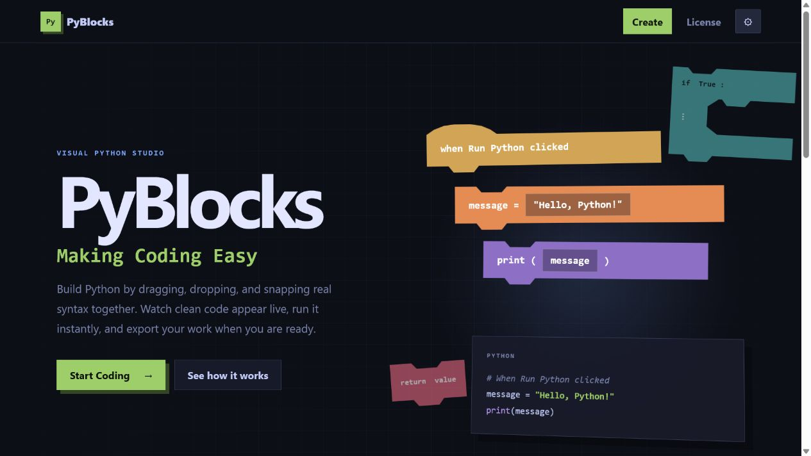

# PyBlocks Studio

**Making Coding Easy** — build Python programs with Blockly blocks, inspect the generated source, run supported programs safely in the browser, and export either Python or an editable visual project.



## What works in the browser

PyBlocks runs code in a dedicated, terminable Web Worker using vendored **Skulpt 1.2.0** in Python 3 mode. The worker keeps infinite loops from freezing the editor, supports Stop, serializes runs, captures standard output and Python errors, and pauses for input in the built-in console.

The tested browser feature set includes:

- variables, arithmetic, comparisons, Boolean operators, and Python precedence;
- nested `if`/`elif`/`else`, `for`, `while`, `break`, and `continue`;
- functions, return values, recursion, lists, slicing, and strings;
- console `print()` and asynchronous `input()`;
- the Skulpt-provided `math`, `random`, and `time` modules.

Skulpt is a Python implementation for browsers, not CPython. Native extensions, sockets, subprocesses, unrestricted network access, and the desktop filesystem are unavailable. Library choices marked **Export only** generate valid desktop-Python imports but are not claimed to execute in the browser. A run is stopped after 10 seconds by default; the Stop button can interrupt it sooner.

## Projects and export

- The editor autosaves a debounced, versioned snapshot in local browser storage and restores it at startup.
- **Save Project** and **Open Project** use `.pyblocks` JSON files containing Blockly serialization, selected libraries, the project name, and execution settings.
- Project files are size-limited and validated before loading. Malformed, unknown-version, unsafe, or invalid Blockly state is rejected without replacing the current workspace.
- **Export Python** writes UTF-8 `.py` source with a final newline. Visual project export remains separate.
- Python source cannot be reimported. Save a `.pyblocks` copy if you want to continue editing a visual project.
- Signed-in users can save compressed `.pyblocks` projects to PyBlocks Cloud. Local `.pyblocks` saving and `.py` export work without an account.
- Only statements connected below the single **when Run Python clicked** event are generated as executable event code. Function-definition hats are generated before that event stack; other floating blocks do nothing.

Autosave is local to one browser profile. Save a `.pyblocks` file or use PyBlocks Cloud for backups and transfer between devices.

## Browser and device support

Automated integration tests cover current Chromium and WebKit, desktop, small and large iPhone layouts, phone landscape, and tablet layout. Firefox should work but is not currently in the required CI matrix. Blockly keyboard navigation has upstream limitations; PyBlocks’ menus, dialogs, settings, project actions, and console controls are keyboard accessible.

Touch dragging depends on Blockly and the device browser. On very small screens, the workspace and code/console panels stack vertically while all essential actions remain available.

## Architecture

| Area                  | Files                                                                | Responsibility                                                         |
| --------------------- | -------------------------------------------------------------------- | ---------------------------------------------------------------------- |
| Pages and styling     | `index.html`, `editor.html`, `license.html`, `css/`                  | Marketing, editor, licensing, responsive themes                        |
| Blocks and generation | `js/blocks.js`                                                       | Block definitions, mutators, Python generators, identifier safety      |
| Editor controller     | `js/main.js`                                                         | Blockly setup, toolbox, libraries, menus, resize/audio integration     |
| Runtime and projects  | `js/python-engine.js`, `js/python-worker.js`, `js/project-format.js` | Code assembly, worker lifecycle, console, autosave, export, validation |
| Accounts and cloud    | `js/cloud-service.js`, `js/cloud-controller.js`, `supabase/`         | Authentication, gzip project storage, per-user access policies         |
| Shared UI             | `js/theme-settings.js`, `js/dialog-controller.js`                    | Preferences, live system theme, accessible modal behavior              |
| Third party           | `vendor/blockly/`, `vendor/skulpt/`                                  | Pinned browser dependencies and their license notices                  |

The editor remains a static frontend. Optional accounts and cloud project storage use Supabase; see `docs/CLOUD_SETUP.md`. PyBlocks has no analytics.

## Local development

Requirements: Node.js 22 or newer and npm.

```bash
npm ci
npm run serve
```

Open `http://127.0.0.1:4173/`. Do not open the HTML directly from `file://`; Web Workers require an HTTP origin.

## Testing and quality checks

```bash
npm test                 # unit and generator tests
npm run lint             # first-party JavaScript linting
npm run format:check     # formatting check
npx playwright install chromium webkit
npm run test:browser     # runtime, persistence, a11y, keyboard, mobile, WebKit
npm run check            # complete suite
```

GitHub Actions runs unit tests, linting, and the browser matrix on pushes and pull requests. Generator tests instantiate real Blockly blocks; runtime tests execute actual worker Python rather than a JavaScript translation.

## Deployment

PyBlocks is GitHub Pages compatible. Publish the repository root as a static site after running `npm run check`. All runtime assets are vendored and use relative paths. The meta Content Security Policy permits only same-origin scripts/workers/assets. GitHub Pages cannot set `frame-ancestors` from repository files; configure that as an HTTP response header if deployment moves to a host that supports custom headers.

## Updating dependencies

Versions are exact-pinned in `package-lock.json`. Dependabot checks npm and GitHub Actions updates.

1. Update the npm package intentionally and run the complete suite.
2. For Blockly, copy the matching browser bundles/media into `vendor/blockly/`; do not manually edit minified files.
3. For Skulpt, copy `dist/skulpt.min.js`, `dist/skulpt-stdlib.js`, and its license into `vendor/skulpt/`.
4. Update the versions in this README and `THIRD_PARTY_NOTICES.md`.
5. Verify bundle-size changes and both Chromium and WebKit before committing.

The legacy `update.bat` and `update/FILES_TO_UPDATE.txt` are owner-managed and are not part of the npm update process.

## Contributing, security, and license

See [CONTRIBUTING.md](CONTRIBUTING.md) before proposing changes and [SECURITY.md](SECURITY.md) for private vulnerability reporting. Dependency and asset notices are in [THIRD_PARTY_NOTICES.md](THIRD_PARTY_NOTICES.md).

PyBlocks Studio uses the custom terms in [LICENSE.md](LICENSE.md). Generated Python belongs to its author as described there. This summary is not a replacement for the license, and the project license has not been changed by the repository audit.
